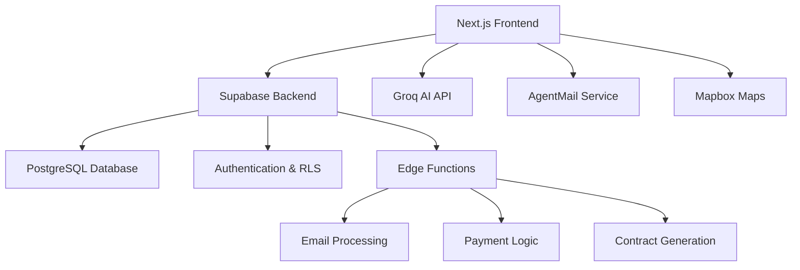

# DeepBooking

<div align="center">


**AI-Powered Venue Booking Platform**

*An intelligent, end-to-end solution for discovering, negotiating, and managing venue bookings for artists and event organizers.*

[Live Demo](https://deepbooking.app) • [Documentation](#documentation) • [API Reference](#api-reference) • [Contributing](#contributing)

[](https://vercel.com/new/clone?repository-url=https%3A%2F%2Fgithub.com%2Fgratitude5dee%2FDeepBookingv1)

</div>

---

## Overview

DeepBooking revolutionizes the venue booking process through intelligent automation and AI-driven recommendations. Built for artists, event organizers, and venue owners, it provides a comprehensive platform that handles everything from initial venue discovery to contract finalization and payment processing.

The platform leverages cutting-edge AI technologies to provide context-aware venue suggestions, automated negotiation workflows, and intelligent contract management—all wrapped in a visually stunning interface powered by modern shader technology and responsive design.

## ✨ Key Features

### 🧠 AI-Powered Intelligence
- **Smart Venue Recommendations**: Context-aware suggestions using Groq AI based on event requirements, budget, and preferences
- **Automated Negotiation**: AI-assisted communication workflows for efficient booking negotiations
- **Predictive Analytics**: Revenue forecasting, demand analysis, and optimal pricing suggestions

### 🔄 Complete Booking Lifecycle
- **End-to-End Management**: Track bookings from initial inquiry through event completion
- **Contract Automation**: Generate, customize, and manage performance contracts with e-signature integration
- **Payment Processing**: Automated payment link generation and tracking with multiple gateway support

### 📧 Advanced Communication
- **AgentMail Integration**: Unique email addresses per booking for streamlined communication
- **Automated Workflows**: Template-based email sequences for different booking stages
- **Communication History**: Complete audit trail of all booking-related correspondence

### 🗺️ Interactive Discovery
- **Mapbox Integration**: Geographic visualization of venues with detailed information overlays
- **Advanced Search**: Filter by location, capacity, amenities, price range, and availability
- **360° Venue Views**: Immersive venue exploration with high-quality imagery

### 📊 Comprehensive Analytics
- **Revenue Dashboards**: Track booking performance, revenue trends, and growth metrics
- **Venue Analytics**: Performance metrics, booking success rates, and market analysis
- **Artist Insights**: Audience demographics, market penetration, and tour optimization

### 🏢 Dual-Sided Platform
- **Artist Dashboard**: Booking management, analytics, and revenue tracking
- **Venue Owner Portal**: Listing management, booking calendar, and performance analytics

## 🏗️ Architecture



**Core Technologies:**

| Layer | Technology | Purpose |
|-------|------------|---------|
| **Frontend** | Next.js 15 (App Router) | React framework with server components |
| **Language** | TypeScript 5.x | Type safety and developer experience |
| **Styling** | Tailwind CSS + shadcn/ui | Utility-first CSS with component library |
| **Backend** | Supabase | Database, authentication, and edge functions |
| **Database** | PostgreSQL | Relational database with RLS policies |
| **AI Engine** | Groq | Fast AI inference for venue recommendations |
| **Email** | AgentMail | Unique email addresses and workflow automation |
| **Maps** | Mapbox | Interactive venue mapping and geolocation |
| **Animation** | Framer Motion + Shaders | Smooth animations and visual effects |
| **Deployment** | Vercel | Serverless deployment platform |

## 🚀 Quick Start

### Prerequisites

- **Node.js** 18.18+ 
- **pnpm** (recommended) or npm/yarn
- **Supabase** account and project
- **Groq** API key
- **AgentMail** account and configuration
- **Mapbox** access token

### Installation

1. **Clone and Install**
   ```bash
   git clone https://github.com/gratitude5dee/DeepBookingv1.git
   cd DeepBookingv1
   pnpm install
   ```

2. **Environment Setup**
   ```bash
   cp .env.local.example .env.local
   ```
   
   Configure your environment variables:
   ```env
   # Supabase Configuration
   NEXT_PUBLIC_SUPABASE_URL=your-supabase-project-url
   NEXT_PUBLIC_SUPABASE_ANON_KEY=your-supabase-anon-key
   
   # AI Services
   GROQ_API_KEY=your-groq-api-key
   
   # Email Service
   AGENTMAIL_DOMAIN=your-domain.com
   AGENTMAIL_FROM_NAME=DeepBooking
   AGENTMAIL_BASE_URL=https://api.agentmail.to
   AGENTMAIL_API_KEY=your-agentmail-api-key
   AGENTMAIL_DEV_MODE=true
   
   # Mapping Service
   NEXT_PUBLIC_MAPBOX_ACCESS_TOKEN=your-mapbox-token
   ```

3. **Database Setup**
   
   Execute the SQL scripts in your Supabase SQL Editor in order:
   ```bash
   scripts/001_create_booking_schema.sql
   scripts/002_seed_venues.sql
   scripts/003_create_functions.sql
   scripts/004_add_agentmail.sql
   scripts/005_agentmail_alias_id.sql
   ```

4. **Start Development**
   ```bash
   pnpm dev
   ```
   
   Navigate to `http://localhost:3000`

## 📁 Project Structure

```
deepbooking/
├── app/                      # Next.js App Router
│   ├── api/                 # Backend API endpoints
│   │   ├── agentmail/       # Email service integration
│   │   ├── bookings/        # Booking management
│   │   ├── contracts/       # Contract operations
│   │   ├── payments/        # Payment processing
│   │   └── groq/           # AI recommendations
│   ├── auth/               # Authentication pages
│   └── dashboard/          # Protected dashboard routes
├── components/             # React components
│   ├── ui/                # Base UI components (shadcn/ui)
│   ├── booking/           # Booking-specific components
│   ├── venue/             # Venue management components
│   └── analytics/         # Analytics and charts
├── lib/                   # Core libraries and utilities
│   ├── email/            # Email client (AgentMail)
│   ├── supabase/         # Database client and middleware
│   └── groq-api-manager.ts # AI service manager
├── scripts/              # Database SQL scripts
│   ├── 001_create_booking_schema.sql
│   ├── 002_seed_venues.sql
│   └── ...
└── public/              # Static assets
```

## 🔌 API Reference

### Booking Management
```typescript
// Create new booking inquiry
POST /api/bookings
{
  "venueId": "string",
  "eventDate": "ISO date",
  "requirements": "string",
  "budget": "number"
}

// Update booking status
PATCH /api/bookings/[id]
{
  "status": "pending" | "negotiating" | "confirmed" | "completed",
  "notes": "string"
}
```

### AI Recommendations
```typescript
// Get venue recommendations
POST /api/groq/recommend
{
  "eventType": "string",
  "location": "string",
  "capacity": "number",
  "budget": "number",
  "date": "ISO date"
}
```

### Contract Management
```typescript
// Generate contract
POST /api/contracts
{
  "bookingId": "string",
  "terms": "ContractTerms",
  "template": "standard" | "premium"
}

// Send contract for signature
POST /api/contracts/send
{
  "contractId": "string",
  "recipient": "email",
  "deadline": "ISO date"
}
```

### Payment Processing
```typescript
// Create payment link
POST /api/payments
{
  "bookingId": "string",
  "amount": "number",
  "description": "string",
  "dueDate": "ISO date"
}
```

## 🗄️ Database Schema

### Core Tables

**venues**
- Comprehensive venue information with amenities, capacity, and pricing
- Geographic data for mapping integration
- Availability calendar and booking rules

**booking_queries**
- Central booking management with status tracking
- Integration with email workflows and contracts
- Revenue and analytics data

**contracts**
- Digital contract storage and version control
- E-signature integration and status tracking
- Template management system

**payment_links**
- Payment processing and status tracking
- Integration with multiple payment gateways
- Automated reminder workflows

**agentmail_inboxes**
- Unique email address management per booking
- Email threading and conversation tracking
- Automated response templates

### Security & Privacy

- **Row Level Security (RLS)**: User-specific data access controls
- **API Rate Limiting**: Prevents abuse and ensures fair usage
- **Data Encryption**: End-to-end encryption for sensitive information
- **Audit Logging**: Complete audit trail for compliance

## 🧪 Testing

```bash
# Run all tests
pnpm test

# Run with coverage
pnpm test:coverage

# Run specific test suite
pnpm test booking

# Run E2E tests
pnpm test:e2e

# Test API endpoints
pnpm test:api
```

## 🚀 Deployment

### Production Deployment

1. **Vercel Deployment**
   ```bash
   # Connect to Vercel
   vercel link
   
   # Set environment variables
   vercel env add GROQ_API_KEY
   vercel env add AGENTMAIL_API_KEY
   # ... add all production variables
   
   # Deploy
   vercel --prod
   ```

2. **Supabase Production**
   ```bash
   # Link production project
   supabase link --project-ref your-prod-ref
   
   # Push schema
   supabase db push
   
   # Deploy edge functions
   supabase functions deploy
   ```

3. **Domain Configuration**
   - Configure custom domain in Vercel
   - Update CORS settings in Supabase
   - Configure AgentMail domain settings

### Environment Variables (Production)

```env
NEXT_PUBLIC_SUPABASE_URL=https://your-project.supabase.co
NEXT_PUBLIC_SUPABASE_ANON_KEY=your-production-anon-key
GROQ_API_KEY=your-production-groq-key
AGENTMAIL_DOMAIN=bookings.yourdomain.com
AGENTMAIL_API_KEY=your-production-agentmail-key
AGENTMAIL_DEV_MODE=false
NEXT_PUBLIC_MAPBOX_ACCESS_TOKEN=your-production-mapbox-token
```

## 📊 Performance & Monitoring

- **Core Web Vitals**: Optimized for 90+ Lighthouse scores
- **Database Performance**: Query optimization with proper indexing
- **Caching Strategy**: Edge caching for static content, smart API caching
- **Error Tracking**: Comprehensive error monitoring and alerting
- **Analytics Integration**: User behavior and conversion tracking

## 🔐 Security Features

- **Authentication**: Supabase Auth with social login support
- **Authorization**: Fine-grained RLS policies
- **Input Validation**: Comprehensive request validation
- **Rate Limiting**: API abuse prevention
- **Data Privacy**: GDPR and CCPA compliant data handling

## 🤝 Contributing

We welcome contributions from the community! Please read our [Contributing Guidelines](CONTRIBUTING.md) for details.

### Development Workflow

1. **Fork the Repository**
   ```bash
   git clone https://github.com/your-username/DeepBookingv1.git
   cd DeepBookingv1
   ```

2. **Create Feature Branch**
   ```bash
   git checkout -b feature/amazing-feature
   ```

3. **Development Setup**
   ```bash
   pnpm install
   pnpm dev
   ```

4. **Make Changes**
   - Follow TypeScript best practices
   - Add tests for new functionality
   - Update documentation as needed

5. **Test Your Changes**
   ```bash
   pnpm test
   pnpm lint
   pnpm type-check
   ```

6. **Submit Pull Request**
   - Use conventional commit messages
   - Include detailed description of changes
   - Reference related issues

### Code Standards

- **TypeScript**: Strict mode enabled with comprehensive typing
- **ESLint**: Enforced code style and best practices
- **Prettier**: Consistent code formatting
- **Conventional Commits**: Standardized commit messages

## 📖 Documentation

- [API Reference](docs/api-reference.md)
- [Database Schema](docs/database-schema.md)
- [Deployment Guide](docs/deployment.md)
- [Contributing Guidelines](CONTRIBUTING.md)
- [Security Policy](SECURITY.md)

## 🚧 Roadmap

### Q1 2025
- [ ] **Mobile Application**: React Native app for iOS and Android
- [ ] **Advanced Analytics**: Machine learning-powered insights
- [ ] **Multi-language Support**: Internationalization framework

### Q2 2025
- [ ] **Event Management**: Comprehensive event planning tools
- [ ] **Vendor Marketplace**: Integrated service provider network
- [ ] **Advanced Contracts**: Smart contract automation

### Q3 2025
- [ ] **White-label Solutions**: Custom branding for enterprise clients
- [ ] **API Marketplace**: Third-party integration platform
- [ ] **Advanced Reporting**: Custom analytics and reporting tools

## 📄 License

This project is licensed under the MIT License - see the [LICENSE](LICENSE) file for details.

## 🙏 Acknowledgments

- **[Supabase](https://supabase.com)**: For their incredible open-source backend platform
- **[Groq](https://groq.com)**: For lightning-fast AI inference capabilities
- **[shadcn/ui](https://ui.shadcn.com)**: For the beautiful, accessible component library
- **[Vercel](https://vercel.com)**: For seamless deployment and hosting
- **[AgentMail](https://agentmail.to)**: For innovative email workflow solutions

---

<div align="center">
  <strong>Ready to revolutionize your booking process?</strong><br>
  <a href="https://deepbooking.app">Get Started Today</a> • <a href="mailto:hello@deepbooking.app">Contact Sales</a>
</div>
